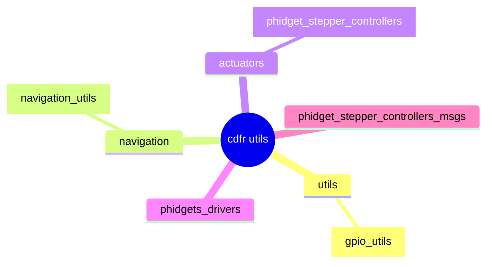

# Description de la repo

Cette repository permet de concentrer l'avancement du robot en ROS2 de ARES pour la CDRF

Structure des packages ROS2 (_si le graphe ne s'affiche pas utiliser [mermaid](https://mermaid.live)_):



# Repere de la map

On se place dans le repère suivant :

```
           <- x positif | x négatif -> 
                     Arrière     
y         ____________(0,0)____________
    Gauche|                           |Droite
p         |                           |
o         |                           |
s         |                           |
i         |                           |
t         |                           |
i         |                           |
f         |                           |
          |                           |
||        |___________________________|
\/                    Avant

```

# Description des packages

## actuators

> Regroupe tous les packages d'actionneurs

### phidget_stepper_controllers

> Met à disposition des classes créant un serveur permettant de controller un stepper phidgets. Il y a trois modes de
> contrôle possible : pas, vitesse, angle 

[Voir le README dédié]


## captors

### gpio_utils
- read_gpio

> Prend en paramètre une liste de pins de la Raspberry Pi 4B (selon le standard de WiringPi) et une fréquence de lecture de ceux-ci (des 0 et des 1 seulement). Si une valeur est lue deux fois de suite, elle est considérée comme stabilisée et mise à jour. Publie régulièrement sur le topic /gpio_readings, et contient un service qui peut être appelé pour lire un pin donné.

## navigation

> Tout ce qui concerne la cartographie, la localisation et la planification de navigation

### navigation_utils

> Permet de controller les déplacements du robot. Deux modes : cmd_vel, liste de mouvement (distance + angle).
> Publie une odométrie.

[Voir le README dédié]

# Auteurs & contributions

- Rémi Weidle [2024]